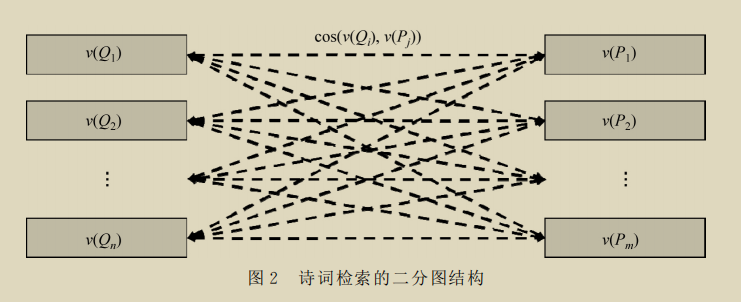
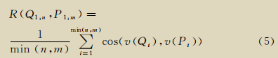
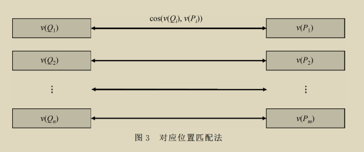
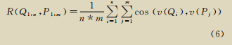
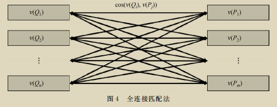
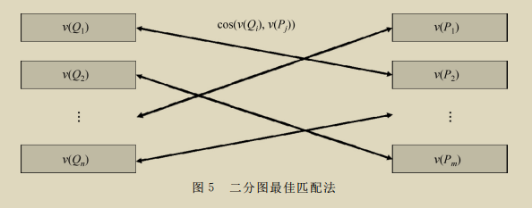
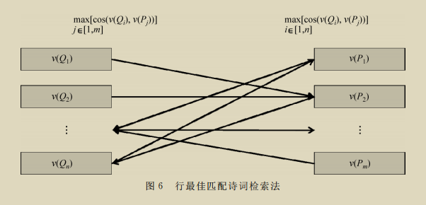

# 计算机创作五言绝句的探究

叶璨铭, 12011404@mail.sustech.edu.cn, 南方科技大学计算机科学与工程系

[TOC]

## 0. 前言

​	“很简单，超越李白的两条路是：一、把超越他的那些诗写出来；二、把所有的诗都写出来！” 在刘慈欣的科幻小说《诗云》当中，人类文明被恐龙文明征服，恐龙大牙向神级文明献上人类诗人伊依，面向神级文明和恐龙文明在技术上的碾压与言语上的嘲讽，他不卑不亢地坚称人类的古诗词是一种不可超越的艺术；神级文明不以为然，认为绝对的技术能够超越任何艺术，于是通过技术化身“李白”感受人类生活，却仍无法作出超越李白的诗；神级文明无奈之下说出此言，欲将所有可能的诗都作出来。为了制造诗云，神级文明毁灭了恐龙文明，作出了所有的诗，却发现无法有效地找到超越李白的诗作。最后，神级文明失望地离开太阳系，留下少数人类与恐龙生活在地球上。[^1]

​	这篇科幻小说借茫茫宇宙中发生的荒诞话剧，提出了艺术能否被技术超越之问，引人深思。那么计算机技术能否作诗呢？能够创作艺术的人工智能可能存在吗？这样的人工智能存在的意义是什么？

​	要回答这些问题，我将从文学和计算机科学两方面进行调查研究，最后提出自己的看法。

## 1. 文学背景与有关研究综述

​	刘江教授在人工智能导论课上做过一个比喻：庖丁解牛之所以能”合于《桑林》之舞，乃中《经首》之会“，是因为他能熟练使用刀，还是因为他对牛的身体结构了解深刻？当然，这两点都非常重要，但是庖丁之所以是解牛之道"进乎技矣"的庖丁，而不是“关公面前舞大刀”的关公，更多在于他对于牛的了解达到了可以”以神遇而不以目视，官知止而神欲行“的地步。有了对牛的了解，用刀时庖丁才能做到”十九年而刀刃若新发于硎”。[^9]

​	对于计算机作诗这个问题来说，人工智能技术是刀，而古诗词文学艺术是牛；要对计算机创作五言绝句的难点有充分的认识，我们很有必要先对古诗词创作的理论、有关研究等背景进行充分了解。

### 1.0 诗歌体裁

#### 1.0.1 文学常识

自反映先秦周代社会生活的《诗经》起直到晚晴，我国古典诗歌发展经历了三千年的悠久历史。在这一漫长历史时期产生的体裁的诗歌统称**旧体诗**，与“五四”后的**新体诗**区别。旧体诗主要分为**古体诗、骚体诗、乐府诗、近体诗**四大诗体。[^2]他们的特点和区别可以总结为下表：

|              | 古体诗                                                       | 骚体诗                           | 乐府诗                                         | 近体诗=格律诗[^2]                        |
| ------------ | ------------------------------------------------------------ | -------------------------------- | ---------------------------------------------- | ---------------------------------------- |
| 出现朝代     | 周朝                                                         | 战国                             | 汉朝                                           | 唐朝                                     |
| 代表作       | 《诗经》《木兰诗》《梦游天姥吟留别》                         | 《离骚》                         | 《观沧海》《蜀道难》《将进酒》                 | 《登鹳雀楼》《夜雨寄北》《江南逢李龟年》 |
| 篇幅（句数） | 不受限制，可长可短                                           | 不限                             | 不限                                           | 绝为四句，律为八句。                     |
| 言数         | 允许杂言，可以以五、七为主                                   | 杂言，七为主                     | 杂言，五为主                                   | 五或者七，不可变。                       |
| 押韵         | 允许平韵、仄韵、邻韵、重韵、每句押韵、中间换韵。无平仄交替、对粘的规定 | 用兮控制节奏。韵脚多变。         | “二三”节拍，抑扬顿挫，比四言更为优美           | 规定较多。                               |
| 表现手法     | 赋、比、兴                                                   | 奇幻瑰丽的想象，铺陈华美的语言。 |                                                |                                          |
| 内容         | 《诗经》歌唱爱情，赞美劳动，揭露现实。                       | 人对神的礼赞钦慕，神灵间的眷恋。 | 建安风骨：反应社会丧乱与人民库曼，期盼建功立业 |                                          |
| 影响         | 《诗经》形成了“诗言志” “美刺” “比兴”“温柔敦厚”的诗教观，被奉为创作圭臬。[^8] | 开创浪漫主义诗篇的先河。         |                                                |                                          |

上面的表格主要是从参考文献第一章[^2]总结的，我觉得其实并不是很科学，

- 有说法说古体诗包括了《诗经》《楚辞》和乐府诗
- 格律诗是否包括宋词、元曲，存在争议。有人认为唐代以后任何出现的新体裁都是近体诗；有人说词、曲在宋、元之前已经有了，只不过这个时期发展好；有人说词有词牌名，收到格律限制，所以也叫格律诗。
- 有说法认为《诗经》不算古体诗，应当独立出来。

历来各种参考文献的概括莫衷一是[^2][^8][^3]，我们没必要把大类分出来，其实只需要明白一下几点：

- 诗歌的源头是歌谣，后来记录为文字。中国古典诗歌的两大源头是现实的《诗经》和浪漫的《楚辞》，来源于周代歌谣和楚国歌谣。[^8]
- 汉代出现汉乐府机构，采集民歌后整理、配乐、演唱。乐府诗继承《诗经》反映现实的传统，五言诗大兴。随后汉末、魏晋南北朝，出现了建安文学、正始文学，然后出现了陶渊明的田园诗和谢灵运的山水诗，发展了北朝民歌、“永明体”，最后以浮艳的“宫体诗”结束。[^8]
- 唐诗达到了中国诗歌的高峰。初唐继承宫体诗，探索了粘缀合律，使得近体律诗定型；初唐四杰继承宫体诗形式美，但是题材改为都市繁华、男女之爱、江山之美、边塞之情，推崇汉魏风骨，关注社会生活与政治问题。盛唐出现诗仙李白、诗圣杜甫，出现山水田园诗人和边塞诗人。中唐诗风走向多元。晚唐诗感慨盛世不再。[^8]
- 宋诗好议论，重理趣，出现苏轼、杨万里、陆游。词是唐代开始发展的新兴诗歌形式，在宋代流行，晚唐有李煜，宋朝出现晏殊、欧阳修、柳永、苏轼、李清照、辛弃疾。[^8]
- 元朝出现小令，是元散曲的一种，形式灵活、文字通俗，内容现实、风格幽默，出现关汉卿、马致远、张养浩。元明清的古体诗、近体诗、词发展缓慢，创新和扩展较少。[^8]

#### 1.0.2 为什么有这么多诗歌体裁，意义是什么？

#### 1.0.3 不同诗歌体裁的创作难点有何不同？

### 1.1 古诗词鉴赏基础

历代对于诗歌鉴赏和研究的成果很多，但相对分散，名目众多。北大中文系和语文教育研究所在教材中将诗歌鉴赏总结为“以意逆志 知人论世”（探究诗歌旨意），“置身诗境 缘景明情“（把握诗歌意境）和”因声求气 吟咏诗韵“（体会诗歌声韵）三个方面。[^8]

#### 1.1.0 以意逆志 知人论世

- 以意逆志
  - 以意逆志是孟子提出的。
  - “故说诗者，不以文害辞，不以辞害志；以意逆志，是为得之。”
    - 诗，指《诗经》。文指个别字词的表面意思，辞是指诗句的内容。
    - 意是指读诗者的情感，是读诗者的切身体会。
    - 志是指作者创作诗歌想表达的主旨与情感。
  - 孟子强调要理解诗歌的主旨情感，不能只是通过个别字词、诗句，而是要通过自己的切身体会。
  - 不过，孟子并没有说文和辞就不重要，相反，由于古典诗歌的字词与现代汉语有一定的差距，正确理解字义、词义反而是重要的一步；尤其是诗歌中用到的重要意象，如果不能正确认识意象词的意思，就会望文生义，出现严重理解偏差。比如王之涣《凉州词》的鉴赏。[^8]
  - 切身体会对于鉴赏的重要性
    - 在于如果没有切身的经历与体会，我们很难理解诗词当中诗人的体验。比如杜牧的《山行》一诗。[^8]
      - 《诗云》中，恐龙大牙仅仅是理解了诗词描述画面的物理意义，无法体会这种画面的美；神级文明在化身人类身躯之后才在宇宙的冰冷中感悟到"念天地之悠悠，独怆然而涕下"的意境。[^1]这是因为他们没有人类的情感体验与生活实践。《诗云》在这一点上符合以意逆志的原理。
    - 在于它让我们可以在不曲解诗词原意的前提下超越诗人创作的原意，生发出新的旨趣，使我们借用古典诗句在新的情景下表达自己的思想感情。[^8]

- 知人论世
  - 知人论世是很重要的鉴赏方法。知人论世是指我们鉴赏诗歌时应当探究作者的生平和为人、全面了解他所生活的环境和时代，这样才能正确理解诗词的主旨感情。
    - 比如阅读杜甫《蜀相》时，除了要对作品中所写的诸葛亮生平与功绩有所了解，还要对杜甫一生遭际、政治理想以及写作时的心境作全面、深入的探究，这样才能充分理解杜甫作此诗的用意。[^8]
  
  - 同样的诗歌，同样的字句，如果是不同的人写出来的，或者同一个作者在不同阶段下的不同心境下写出来的，我们对它的理解都会有所不同。

#### 1.1.1 置身诗境 缘景明情

- 置身诗境
  - 中国古典诗歌中，不少作品具有诗情画意，意境优美，我们在欣赏这些作品时可以借助联想和想象，把作者描绘的意象和画面再现到脑海中，得到审美享受。[^8]
  - 诗歌的情景可能准确地描述了我们曾经有过的生活体会，与我们产生共鸣；也有可能描述的想象奇特的情景，扩展我们的体验。
- 缘景明情
  - 王国维认为“昔人论诗词，有景语、情语之别。不知一切景语皆情语也。”[^3]
  - 写景的过程中，诗人往往自然地就能借景抒情。

#### 1.1.2 因声求气 吟咏诗韵

- 因声求气
  - 因：凭借。声：诗歌的声律（包括节拍和用韵）。气：指作品的精神气质
- 吟咏诗韵
  - 

### 1.2 格律诗创作概念

## 2. 计算机科学背景与有关研究综述

### 2.0 计算机、算法、人工智能之极限

### 2.1 这学期学的算法设计技术能不能为作诗建立有用的简单模型？

在这一学期，我学习了《算法设计》这门课程，该课程从五个经典的算法问题出发，循序渐进的讲述了算法设计与分析的几大范式，揭示了算法设计与算法分析的辩证关系，强调设计巧妙的算法对现实问题进行合理的数学建模，以期解决实际问题。

《三体1》当中，三体人为了解决三体问题，从“周文王”的巫术、“孔子”的礼、“墨子”的火球模型、“哥白尼”的恒星理论、”秦始皇“的人形计算机、“爱因斯坦”的演化计算等等，逐步对三体世界的问题认识更加深刻。我们也可以从经典的、简单的算法设计范式开始，逐渐认识计算机作诗算法的本质。

- 暴力算法

- 贪心算法
- 动态规划算法
- 分治算法
- 网络流算法

### 2.2 信息论：信息量、信息熵、香农定理与巴别图书馆

### 2.3 古诗词相似度、古诗词检索与古诗词创作

​	《诗云》的结尾中，神级文明把描写人类诗人伊依和一名美丽村姑的乡村爱情故事的诗从诗云检索出来，把存储这首诗的量子晶片送给伊依，给小说增添浪漫色彩。[^1]实际上，了解了我们在2.2节看到的信息论之后很快就会明白，把“乡村爱情故事的诗”从诗云中检索出来几乎是不可能的，检索这首诗的过程，实际上等价于神级文明自己创作了一首“乡村爱情故事的诗”，把它送给伊依。

​	**实际上，对所有的古诗词集合语义检索特定意义的、写得好的一首诗，等价于直接创作这一首诗。**这是为什么呢？我们想象一个简单的五言绝句搜索引擎，输入"伊依", 可以搜索到"伊依"在第一句、第二句、第三句、第四句的所有诗，可以搜索“伊依”是五言绝句前两个字、第2-3字，第3-4字....。 假设我们有一个理想的"量子计算机"，我们搜索“伊依”作为五言绝句前两个字的所有的诗，然后这个理想计算机就能像IDE一样，自动把所有符合条件的候选项列出来，那么我们看到的第0首诗是 ”伊依啊啊啊, 啊啊啊啊啊。啊啊啊啊啊, 啊啊啊啊啊“, 第1首诗是 "伊依啊啊啊，啊啊啊啊啊。啊啊啊啊啊，啊啊啊啊唉。"给出了“伊依”这样简单的搜索信息进行字符串匹配检索并不能帮助我们有效筛选符合条件的诗，候选列表(搜索结果)中仍然有300018这么多首诗。

​	然而，我们并不因此而绝望，认为古诗词创作是不可能的，**这反而为我们用计算机如何创作古诗词提供了比创建“诗云”更合理的思路——建立检索技术的评价标准，然后用更加先进的检索技术，我们就能解决古诗词创作的问题。**一些计算机科学的研究者就是用这样的思路去做的，我们刚才用的是简单的字符串匹配算法，这仅是自然语言处理中语义搜索的最简单算法。[^7]清华大学计算机系的梁健楠等人在论文中详细研究了古诗词的检索方法，实现了输入一首诗词，检索数据库中与原诗语义上相近、意境上相似、风格上相仿的古诗词，经过自动评测和人工评测，效果很好。[^6]

​	有了这样的语义搜索算法，我们至少拥有了“超越李白”的第一种有效的思路，用李白的诗去搜索诗云，看看有没有和李白风格相似的好诗，当然我们要指出，我们没有科幻当中的量子计算机，我们仍然只能使用线性搜索算法，复杂度O(|Σ|^n), 由于诗词相似度函数不是单调的，我们也不能用计算机科学中经典的“二分答案”法来降低复杂度。下面我们来看看梁健楠他们是怎么做的。

#### 2.3.1 检索问题的形式化定义——相似度

设查询的诗词Q和候选的一首诗词P为
$$
Q_{1:n}=Q_1Q_2...Q_n\\
P_{1:m}=P_1P_2...P_m
$$
其中Qi为Q诗词的第i个句子，n为Q诗词的句子数，P同理。

定义评分函数R，评估Q与P的相关程度。
$$
R(Q_{1:n},P_{1:m})
$$
只要提出合理的R，就可以根据R对诗库中所有后诗词进行排序，给出推荐诗词。[^6]

这种定义方法并不局限于古诗词，而适用于所有检索问题,甚至所有存在有限答案的问题[^14]，比如字符串匹配、序列比对、复杂相似度函数下的字符串匹配、二分匹配。根据不同的R函数的特点，这些问题有不同的数据结构和不同的算法设计方法，比如KMP，二分搜索、动态规划、卷积、网络流等。[^5]

**这些问题虽然很有意思，但是它们的难点在如何利用R函数的性质加速检索，让复杂度控制到合理的范围内，而古诗词检索之所以比其他检索问题困难，在于连R函数都难以定义。**于是他们提出了用深度学习的一些方法去解决。

#### 2.3.2 句向量提取

##### 2.3.2.1 什么是词向量？什么是句向量？

自然语言处理当中，分析的对象从细粒度到粗粒度分为词语、句子、段落、篇章、文档。以词语为例，要判断一个词的词性，我们要从大量的样本(词语，词性)中机器学习出函数f(词语)->词性。[^12]

对于机器学习，我们需要用向量去表示这个词语，因此我们对于输入的词语需要进行词嵌入(word embedding)。[^12]

最简单的词嵌入就是按照词语原本的编码二进制向量。然而，词语的词性往往与上下文是有关系的，因此才提出了经典的Word2Vec、现代的基于LSTM带Attention机制的Encoder-Decoder模型等。

这些模型关注到词语的上下文，借助OneHot Encoding等手段，将上下文函数训练后的权重作为词语表征的向量，称为词向量。如图，用领域有关的语料进行训练，左边输入的是词语的One hot encoding，右边y是样本词语的上下文词语，当该神经网络训练完毕后，中间隐藏层前W矩阵的权重就可以表征左边输入的词语了，这就是词向量。[^12] 注意，词向量的维度是固定的,尽管输入的词语可能有不同的长度。[^13]

对于古诗词检索的任务而言，诗句的相似度是诗词的相似度的基础，因此，有必要对诗句求句向量。

句向量的求解方法如下：如果不考虑句与句之间的关系，可以直接由词向量求和、求均值得到。更进一步，可以求解词语在语料当中的TF-IDF值来求加权平均值。[^12]由于诗句向量比较简单，一般直接采用平均数。[^6]

#### 2.3.3 R函数的几种设计及效果

##### 2.3.3.1 诗词向量诗词检索法(Poetry retrieval with poem vector, PRPVec)

前面我们已经理解了，诗句向量就是词向量的简单加和求平均值。那么如果我们对诗词的每一句的句向量加和求平均，是不是就能直接得到诗词向量呢？

答案是肯定的。当我们用这种方法计算了诗词的向量表示之后，我们就可以使用余弦距离(向量的夹角)来计算两首诗词的相似程度，这种方法称为诗词向量诗词检索法(Poetry retrieval with poem vector, PRPVec)。[^6]

该算法的弊端是糅合了诗词的词向量和句向量，没有充分考虑句子与句子之间的关系。[^6]

##### 2.3.3.2 二分匹配问题

二分图是一个无向图，其节点集可以划分为Q和P，使得任何一条边的一端来自Q，另一端来自P。

- 行连接诗检索法（PRLC）

  - 这种方法直接求取R函数为相同行余弦距离的均值。
  - 依据是诗词的结构，相同位置的诗句具有相同的文学结构。
  - 
  - 

- 全连接匹配（PREC）

  - 这种方法定义R为句子两两之间的余弦值之和
  - 
  - 

- 二分图的最佳匹配与网络流算法

  匹配M是边集E的子集，使得每个节点最多出现在一条边上。匹配里面，可能有些节点没有被选中，所以求解最大匹配是一个重要的算法问题。[^5]

  如果没有权重，这是一个网络流问题。[^5]

  对于诗句向量作为节点的二分图，我们要求最大权重匹配，可以使用KM算法。这种方法称为**最佳匹配诗词检索法（PRBM）**

  

  KM算法复杂度较高，因此梁健楠等认为可以用贪心策略替代，称为**行最佳匹配诗词检索法(PRLBM)**

  

##### 2.3.3.3 效果分析

最终，梁佳楠等人进行了人工评测与机器评测，**发现各个模型保持了一致性（最相似的诗是搜索的诗本身），然后PRLBM与PRBM的效果最好。**[^6]

## **3. 总结与评论**

### 3.0 计算机作诗的任务设计本身是最重要的难点

关于如何用计算机来作诗，有不少文献，然而文献对"作诗"这个任务的理解却并不统一。周紫婷

### 3.1 没有计算机鉴诗，何来计算机作诗？

### 3.2 没有知人论世，何来鉴赏？

​	《诗云》当中的神级文明，虽然作出了所有的诗歌，是所有可能的诗歌的“作者”，但是神级文明最多只能说是诗歌的物理载体“诗云”的作者，而非每一首诗歌的作者。神级文明创作诗云的心境，只是为了用技术去超越艺术，不可算是其中超越李白的诗句的作者。

​	前文在知人论世当中我们提到，同样的诗歌，同样的字句，如果是不同的人写出来的，或者同一个作者在不同阶段下的不同心境下写出来的，我们对它的理解都会有所不同。

### 3.3 艺术与技术的辩证关系

技术能不能超越艺术，这个问题其实简单的把技术和艺术看成了对立的两个对象，而没有看到艺术和技术实际上是紧密联系的。我认为，技术决定艺术，艺术的发展反映技术的发展、反作用于技术的发展。

抽象来说，

- 技术属于科学技术，是第一生产力。生产力是经济的一种体现。艺术则是文化的一种体现。

- 一定的经济和政治决定一定的文化，一定的文化给予一定的政治和经济以重大影响。
- 文化是人类（或者一个宇宙中的文明）社会实践的产物，是人类政治、经济之外的全部精神活动和产品，是一种社会精神力量。文化产品是用一定的物质载体承载的文化。

具体来说，

- 诗歌是文化产品，来自于诗人的社会实践，承载了诗人的精神力量。
- 
- 《诗云》中，“诗云”本身是一项伟大的工程，一项伟大的艺术，得益于神级文明强大的技术。神级文明为了超越另一项艺术——人类古诗词而写出了所有的诗，这一行为本身有戏剧性，也是一种艺术。

### 3.4 无文明，无艺术——人工智能作诗的哲学意义思考

## 参考文献

[^1]: [诗云|刘慈欣|小说免费阅读|全文在线阅读|雨枫轩 (rain8.com)](https://www.rain8.com/book/1374/)
[^2]: 竺士元. 格律诗新探——唐人引以为豪的当时体
[^3]: 王国维著, 思履主编. 人间词话（全解版）
[^4]: 周啸天. 唐宋绝句鉴赏辞典 
[^5]: Joe & Eva. 算法设计.
[^6]: 梁健楠,孙茂松,矣晓沅.基于深度神经网络的诗词检索[J].中文信息学报,2020,34(12):82-91.
[^7]: 武苏雯. 经典诗词的语义搜索与应用[D].中原工学院,2021.DOI:10.27774/d.cnki.gzygx.2021.000190.
[^8]: 北京大学中文系 语文教育研究所. 语文 选修 中国古代诗歌散文欣赏   
[^9]: [庖丁解牛原文、翻译及赏析_庄子文言文_古诗文网 (gushiwen.cn)](https://so.gushiwen.cn/shiwenv_8def13da8f71.aspx)

[^10]: [科学网—计算机与计算模式 (1) 何谓计算机？ - 程京德的博文 (sciencenet.cn)](https://blog.sciencenet.cn/blog-2371919-863655.html)

[^11]: [【戴建业】深度解析《将进酒》，劝酒仙人李白的上头之作_哔哩哔哩_bilibili](https://www.bilibili.com/video/BV1dv411y7Qx?spm_id_from=333.337.search-card.all.click)[【戴建业】一首诗让贺知章惊为仙人！为什么只有李白能写出《蜀道难》？上篇_哔哩哔哩_bilibili](https://www.bilibili.com/video/BV1DR4y177QQ/?spm_id_from=333.788.recommend_more_video.-1&vd_source=3341028a05b4f70d2386ed4128f1dac0)[【戴建业】《蜀道难》写的是李白对杜甫的担心？过度解读！_哔哩哔哩_bilibili](https://www.bilibili.com/video/BV1qP4y1L7EX/?spm_id_from=333.788.recommend_more_video.-1)

[^12]: [[NLP\] 秒懂词向量Word2vec的本质 - 知乎 (zhihu.com)](https://zhuanlan.zhihu.com/p/26306795)

[^13]: [自然语言处理中句向量获取方式的简要综述 - 知乎 (zhihu.com)](https://zhuanlan.zhihu.com/p/350957155)

[^14]: 查尔斯·赛费 著 隋竹梅译. 解码宇宙. 