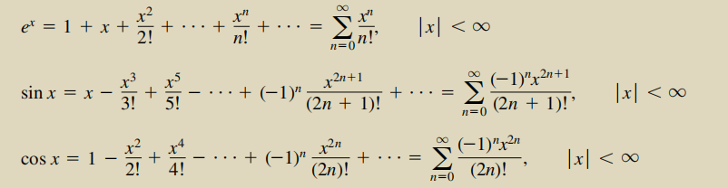

# 基于快速傅里叶变换的卷积加速算法的探究

叶璨铭, 12011404@mail.sustech.edu.cn

[TOC]

## 前言

本学期的算法设计与分析课从分治算法设计的角度，讲解了快速傅里叶变换对多项式乘法具有加速作用。
然而，尽管老师讲解了很多，脑子还是一片空白。究其原因，一方面当初学习线性代数的时候，课程大纲跳过了相关章节，致使省略的不少数学细节看起来十分生疏，另一方面并没有学习信号与系统课程，因此尽管已经多次听说、从各个角度传说了“卷积”一词，我依然只能盲人摸象，只见树木不见森林。与其安慰自己说这些并不是算法设计课的内容而置之不理，不如迎难而上，趁机自学相关内容，从根本上理清楚整个问题的来龙去脉。

因此，本次作业中，首先对缺失的先修知识进行细致地学习、梳理，然后重新回到 基于快速傅里叶变换的卷积加速算法 问题当中，**利用 Python 有关库实现算法(见3.1-3.4)**，检验学习成果。

可以跳过1.和2.，直接阅读3.。

## 1. 从复数、复数矩阵到傅里叶矩阵 —— 线性代数视角

### 1.1 复数的本质[^1][^2]

我们在高中数学和线性代数就学过复数的概念，这里并不赘述，而是记录一些要点，加深对复数的本质的理解。如果要加快阅读速度可以跳过本部分。

#### 1.1.1 基本概念

- 复数是在研究代数方程时，特别是研究一元三次方程求根公式的过程中，逐步引入的。

- 数系扩充为负数，解决了新的问题，同时加法、乘法仍然满足交换律、结合律、分配律。

- 定义复数、虚数、实数、纯虚数等集合的范围。这里不赘述了。

- 引入虚数单位i。复数 z=a+bi

- 定义共轭复数。
  
  
  
  

#### 1.1.2 加减乘除定义

- **把i看成多项式的变量，a、b看做多项式的系数，可以定义加减乘**。根据多项式的加减乘性质，复数的加减乘也有相应的性质（比如交换结合分配）。
- 除法为乘法的逆运算。一般根据平方差公式，上下同乘共轭复数来解决。

#### 1.1.3 加减乘除的几何意义

- 直角坐标形式（代数表示式）

  - 韦塞尔、阿尔冈、高斯指出，复数z = a+bi可以可以与一个平面上的一个直角坐标系表示的坐标(a,b)一一对应。
  - 这个坐标连接原点形成的向量也是一一对应的。定义向量的模为复数的模。平面称为复平面。
  - 加减的意义正好和向量加减意义一致；
  - 

- **极坐标形式（三角表示式）**

  - 另一方面，我们知道直角坐标系的坐标和极坐标系的坐标也是一一对应的，所以复数也可以与极坐标建立对应关系。
  - 

  
  
  - **根据三角恒等变换的各种公式，推导出复数的乘除有旋转、拉伸的意义。**

- **欧拉公式[^2]**

  - 
    
  - 从而
    
  
- 变成了一个幂，那更容易发现，乘法就是幅角相加，模长相乘。
  
- 从高中课本可以看出，引入欧拉公式其实没必要，因为直接通过三角函数的性质也能够很好的认识复数的三角形式与复数乘除法了。引入欧拉公式之后，只是看起来更加优美。

#### 1.1.4  代数基本定理、1的n次方根（单位复根）、欧拉公式

- **代数基本定理**：一元n次复系数多项式方程f(x)=0 至少有一个复数根。
  - 推论：可以分解为n个一次因式的乘积（数学归纳法证明）

- 1的n次方根。
  
  - 定义复数的整数次幂为多次复数乘法运算。
  - 棣莫弗定理：复数的n次幂的模等于复数的模的n次幂，幅角等于复数幅角的n倍。其中n为整数。
  - 由此可以推导出来1的n次方根一共有n个，幅角均分了2pi，为复平面单位圆的n等分点。
  
- 欧拉公式如何证明？[^4]
  
  - 从高等数学的观点来看，满足条件的函数f(x)可以展开为以a为中心点的多项式，系数为无穷数列an，这个多项式称为幂级数，展开过程称为泰勒展开。
  
  - 其中，有结论
  
    
  
  - 因此只需要把θ带入，化简一下，就能“证明”欧拉公式。
  
    
  
  虽然是泰勒展开看起来很有道理，推出来了，但是总是感觉怪怪的，原因在于我们无法理解e^ix 是什么东西——虽然我们定义了复数的加法、复数的乘法，但是复数的复数次幂是什么东西呢？对于实数或者简单点，有理数的作为指数的幂，我们知道他是从整数作为指数的幂扩展出来的，定义为二分法逼近这个值。
  
  书上证明后面有这么一句评注：
  
  > This does not *prove* that the Euler's identity because we have not yet defined what 
  >
  > it means to raise *e* to an imaginary power. Rather, it says how to define *e**i*u to be consistent with other things we know about the exponential function for real numbers.
  
  意思是说，我们通过欧拉公式（假设他是对的），上面的推导可以定义复数的复数次幂，使得复数的规则和实数中推导出来的泰勒展开是没有矛盾的。

### 1.2 如何认识复数矩阵？[^2]

个人认为，线性代数、矩阵的精华在于，通过合适的定义，能够把单个数的性质扩展到很多个数的性质，进行批量的运算，得到很多数学的感悟与认知。复数矩阵相比实数矩阵，要让各种批量运算有意思，就要适当修改之前的一些认知实数矩阵的方法，提出的新的定义。

- 复数向量的模长定义
  - 模长是范数，类似于距离，数学上要满足非负性、齐次性、三角不等式。
  
  - 实数的时候，我们定义
    
    
  - 对于复数来说，这个不对。
  
  - 从单个复数着手，需要
    
    这就启发我们如此定义
    
  
- 对称矩阵->赫米特矩阵

  Hermitian matrix A<sup>H</sup>=A

  性质：有实数特征值

- 垂直的定义
  
  进而可以从正交矩阵出发定义酉矩阵（Unitary Matrix）

  

  其每一个列向量之间垂直，且长度为1.

  我们马上要提到的**傅里叶矩阵经过数乘是酉矩阵**。

### 1.3 最著名的复数矩阵——傅里叶矩阵[^2]


w为1的n次单位复根中最小非负根。从线性代数的角度，我们的目的是说傅里叶矩阵乘上一个向量，就完成了傅里叶变换，逆傅里叶变换很容易，在于U是酉矩阵。

从线性代数的角度来说分治，就是Fourier矩阵可以分解为小的傅里叶矩阵和别的操作矩阵的乘积，是一种厉害的矩阵分解。比如：


## 2. 卷积和傅里叶变换 ——信号与系统视角

pass，后面再补充。

## 3. 卷积的Python实现

需要用到的库：

```python
import numpy as np
from scipy.fftpack import fft,ifft
```

和1.中提到的傅里叶矩阵的关系：

设有向量a，长度为l，则


### 3.1 暴力实现

- 卷积公式[^3]

  假设给定向量 
  
  那么，卷积c为如下向量
  :&space;i&plus;j=k,\&space;i,j<n}&space;a_ib_j)
  换言之，
  
  
- 根据以上公式定义，可以写出Python代码：

```python
def conv_by_brute_force(a:np.array, b:np.array)->np.array:
    new_length = (b.size-1)+(a.size-1) + 1
    c = np.zeros(new_length)
    for i in range(new_length):
        for j in range(max(0, i-b.size+1), min(i+1, a.size)):
            c[i]+=a[j]*b[i-j]
    return c
```

### 3.2 快速傅里叶变换实现

把卷积看做两个多项式相乘得到新的多项式。

- 首先，需要把多项式扩展到结果多项式的维度，为更高项补零，这样生成的点才足够还原结果多项式。
- 然后，对输入的两个多项式向量进行快速傅里叶变换，也就是乘上了一个傅里叶矩阵。
- 得到的是两个多项式在相应x时的y值。进行相乘，得到结果多项式在相应x时的y值。
- 对相乘后的y值进行快速逆傅里叶变换，也就是乘上了傅里叶矩阵的逆矩阵。得到结果多项式。

以上流程可以用Python代码实现如下：

```python
def conv_by_fft(a:np.array, b:np.array)->np.array:
    new_length = (b.size-1)+(a.size-1) + 1
    a = np.append(a, np.zeros(new_length-a.size))
    b = np.append(b, np.zeros(new_length-b.size))
    a = a.reshape(new_length)
    b = b.reshape(new_length)
    y_a = fft(a)
    y_b = fft(b)
    y_c = y_a*y_b
    c = ifft(y_c)
    return c
```

### 3.3 结果验证

```python
v1=np.array([2, 3, 4, 5, 6])
v2=np.array([1, 4, 7, 10])
c1 = conv_by_brute_force(v1, v2)
c2 = conv_by_fft(v1, v2)
c3 = conv_by_brute_force(v2, v1)
c4 = conv_by_fft(v2, v1)
assert (c1==c3).all() and (c2==c4).all()
print(c1)
print(c2)
print(c3)
print(c4)
abs(c1-c2) < np.spacing(1)
```


交换律基本是满足的，assert没有报错。

不过两种方法的精度确实不同，np.spacing(1)类似于MATLAB的epsilon，表示浮点数几乎可以认为相等，但是这里却有两个False。

### 3.4 时间比较

- 理论分析：
  
  
  
- 实验设计：

  1. 对于老师给的v1和v2（长度为5和4）

  	```pyt
  	%%timeit
  	c2 = conv_by_fft(v1, v2)
  	```

  	29.3 µs ± 614 ns per loop (mean ± std. dev. of 7 runs, 10000 loops each)

  	```pytho
  	%%timeit
  	c2 = conv_by_brute_force(v1, v2)
  	```

  	18.3 µs ± 101 ns per loop (mean ± std. dev. of 7 runs, 100000 loops each)

  	可以看到暴力算法快一点，但也不多。
  	
  	用理论公式来算，
  	
  	很准确，实际的时间确实是1.6倍左右。
  	
  2. 让n和m为1000

     ```python
     v1 = np.random.random(1000)
     v2 = np.random.random(1000)
     ```

     ```python
     %%timeit
     c2 = conv_by_fft(v1, v2)
     ```

     287 µs ± 7.02 µs per loop (mean ± std. dev. of 7 runs, 1000 loops each)

     ```python
     %%timeit
     c2 = conv_by_brute_force(v1, v2)
     ```

     545 ms ± 7.62 ms per loop (mean ± std. dev. of 7 runs, 1 loop each)
     
     可以看到，fft 预计加速了68倍，实际加速1898倍。

  3. n = 10000, m = 9

     ```python
     v1 = np.random.random(10000)
     v2 = np.random.random(9)
     ```

     ```python
     %%timeit
     c2 = conv_by_fft(v1, v2)
     ```

     966 µs ± 7.89 µs per loop (mean ± std. dev. of 7 runs, 1000 loops each)

     ```python
     %%timeit
     c2 = conv_by_brute_force(v1, v2)
     ```
     
     57.6 ms ± 542 µs per loop (mean ± std. dev. of 7 runs, 10 loops each)
     
     fft 理论加速0.83倍，实际加速57.22倍。

- 实践指导

  - n,m上百上千的时候，还是用快速傅里叶变换好得多。
  - 当n很大，但是m很小的时候，如果n特别大，其实也是快速傅里叶变换好。这个从公式很难看出来，因为你会说一个是nlogn，一个是n，n肯定更快。但是事实上logn可能很小，这个时候得比常数。经过我的实验，Python的fft优化的非常好，所以看起来很快。

## 参考文献

[^1]: [第七章 复数-新人教A版高中数学第二册 (qq.com)](https://mp.weixin.qq.com/s?__biz=MzU3NTg3MTYyMQ==&mid=100006195&idx=3&sn=9038012e14e9839484c4b1ffe20e9891&scene=19#wechat_redirect)
[^2]: Strang, G. (1988). Chapter 5 Eigenvalues and Eigenvectors. In *Linear algebra and its Application* (4th ed., pp. 312–321). essay, Acad. Press.

[^3]: 课本：Kleinberg & Tardos 算法设计。

[^4]: Thomas, G. B., Hass, J., Heil, C., Weir, M. D., & Luis, Z. E. J. (2020). Chapter 10 Infinite Sequences  and Series. In *Thomas' calculus*. essay, Pearson.

