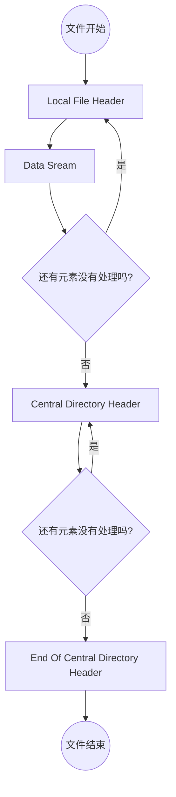
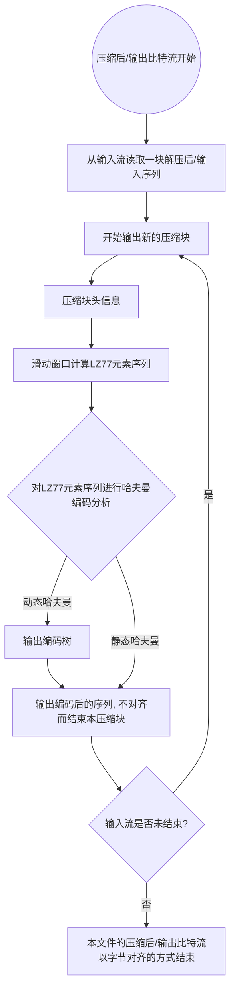

# Project: Implement a ZIP compressor hand by hand

**Name**：叶璨铭(Ye CanMing)

**SID**：12011404

This document is also available on [github]([P_Algorithm_Design_and_Analysis_cpp/ZipReport.md at master · 2catycm/P_Algorithm_Design_and_Analysis_cpp (github.com)](https://github.com/2catycm/P_Algorithm_Design_and_Analysis_cpp/blob/master/doc/Zip/ZipReport.md)) .

[TOC]

## 0. Problem Introduction

### 0.0 Project Goal

ZIP（大写）是一种支持**无损数据压缩**的**档案文件格式**。[^1]

- 所谓档案文件，是指将文件系统上的一个或多个文件通过一些元数据的组合，存档到文件系统上**形成的单个文件**。[^2]
- 存档之后，文件往往用于传输分享、储存收藏，所以通常**压缩和加密**是很重要的。
- ZIP也支持加密[^3]

本次Project的目标是通过实战手写实现一个ZIP压缩软件，

- 深入理解**数据压缩的算法设计思想、思路**；
- 初步了解**二进制文件格式**的**设计方式**、二进制文件软件的**工程难点**。

### 0.1 Problems to Investigate

- 如何把文件夹中的所有文件存档到ZIP文件中？（遵循ZIP格式要求）
- 能否让专业的解压软件能够正常地解压我们生成的ZIP文件？（确保我们的软件没有bug，符合ZIP规范）
- 如何实现ZIP的压缩算法？DEFLATE算法的效果如何？原理是什么？

## 1. Codes

### 2-0 Project Hierarchy

```
main/cpp/cn/edu/SUSTech/YeCanming/  类似于java的maven、gradle项目管理，包（命名空间）特别长，据说有利于避免冲突，别人调用时不会污染到他们写的命名。
└───Zip/
    ├───entities/					存放结构体，作为ZIP文件数据的内存表征。
        ├───CentralDirectoryHeader.hpp
        ├───EndOfCentralDirectoryHeader.hpp
        ├───LastWriteTime.hpp
    	└───LocalFileHeader.hpp
    ├───utilities/					存放工具函数、类。
    	└───filesystem.hpp
    ├───ZipMain.cpp 				实现命令行压缩工具。
    └───ZipUtils.hpp				实现C++压缩库。

test/cpp/cn/edu/SUSTech/YeCanming/ 类似于java的maven、gradle项目管理，把测试代码和主要代码分开，测试驱动开发。测试使用googletest框架。
└───Zip/
    ├───BinaryIO.cpp               	测试C++二进制读写的各种用法是否与期望一致。
    ├───EntityTest.cpp				测试entities包下的实体类。
    ├───FileSystemTest.cpp			测试C++文件系统库的各种用法是否与期望一致。
    ├───ZipUtilsTest.cpp
    └───ZlibTest.cpp
resources/testData/Zip/ 存放测试数据
```

### 2.1 Code Exhibition

Key test codes are shown in part 2.  Entities, Utilities Code are shown in part 3.

To get more updated and integral codes, view on [github]([P_Algorithm_Design_and_Analysis_cpp/src/main/cpp/cn/edu/SUSTech/YeCanming/Algs/Zip at master · 2catycm/P_Algorithm_Design_and_Analysis_cpp (github.com)](https://github.com/2catycm/P_Algorithm_Design_and_Analysis_cpp/tree/master/src/main/cpp/cn/edu/SUSTech/YeCanming/Algs/Zip)).

```cpp
//ZipUtils.hpp partial.
/**
         * compress src folder and all its contents into a zip file dst.
         * @param src
         * @param dst
         * @param limit in case the compressed directory is too large, a limit is required.
         * @return whether the compression was successful.
         */
        bool compress(stdfs::path const &src, stdfs::path const &dst, size_t limit) {
            std::fstream dst_file{dst.c_str(), std::ios::binary | std::ios::out | std::ios::trunc};
            if (!dst_file.is_open())
                return false;
            std::stringstream centralDirectoryHeaders;
            uint16_t fileCnt{0}, directoryCnt{0};
            if (!utilities::filesystem::preorderTraversal(src, [&](const stdfs::path &current_path) {
                    if (--limit < 0)
                        return false;
                    if(stdfs::is_regular_file(current_path))
                        ++fileCnt;
                    else{
                        assert(stdfs::is_directory(current_path)); //symbolic link is not supported yet.
                        ++directoryCnt;
                    }
                    const auto relativePath = stdfs::relative(current_path, src/"..");
                    const uint32_t offset = dst_file.tellp();
                    entities::LocalFileHeader header{current_path, relativePath};
                    dst_file << header;
                    assert(dst_file.good());
                    entities::CentralDirectoryHeader cdheader{header, offset};
                    centralDirectoryHeaders << cdheader;
                    assert(centralDirectoryHeaders.good());
                    return true;
                }))
                return false;
            uint32_t centralHeaderBegin = dst_file.tellp();
            uint32_t centralHeaderBytes = centralDirectoryHeaders.tellp();
            dst_file << centralDirectoryHeaders.rdbuf();
            assert(dst_file.good());
            entities::EndOfCentralDirectoryHeader endHeader{directoryCnt, fileCnt, centralHeaderBytes,centralHeaderBegin};
            dst_file << endHeader;
            assert(dst_file.good());
            dst_file.close();
            return true;
        }
```


## 2. Result & Verification

### 2.0 单元测试

#### 2.0.0 文件最后修改时间正确性

- 语法学习测试：

通过改编 *https://stackoverflow.com/questions/61030383/how-to-convert-stdfilesystemfile-time-type-to-time-t?msclkid=e4adf3faba6911ecb78dd1ec928b9478*

 https://en.cppreference.com/w/cpp/filesystem/last_write_time?msclkid=2993e168ba6711ec8e7fdfa63e4a8d15

https://zh.cppreference.com/w/cpp/filesystem/path/generic_string 上的示例代码，写入测试运行，对基础用法已经了解。

- 运行EntityTest.cpp

  ```cpp
  TEST(TestLastWriteTime, testBZip) {
          auto p = std::filesystem::path(CMAKE_PROJECT_DIR) / "testData" / "Zip"/"test.binary";
          auto ftime = std::filesystem::last_write_time(p);
          LastWriteTime last_write_time{ftime};
          std::cout << std::hex << std::setfill('0') << std::setw(2);
          std::cout << last_write_time.mTime << std::endl;
          std::cout << last_write_time.mDate << std::endl;
          uint16_t validate[] = {0xA8C8, 0x548E};
          EXPECT_EQ(0, memcmp(validate, &last_write_time, sizeof(validate)));
          std::time_t t{last_write_time};
          std::cout << std::ctime(&t) << std::endl;
          std::cout << std::asctime(std::localtime(&t)) << std::endl;
      }
  ```

  可以看到，LastWriteTime对象确实封装了符合ZIP要求的时间结构，与压缩软件生成的0xA8C8, 0x548E一致。

  测试使用了google test，

#### 2.0.1 LocalHeader 实体类的正确性

- 运行EntityTest.cpp

```cpp
TEST(TestLocalHeader, constructAndWrite){
        const auto root = stdfs::path(CMAKE_PROJECT_DIR)/"testData"/"Zip";
        const auto filepath = root/"test.binary";
        const auto relativePath = stdfs::path("test.binary");
        // note: 假如我们对Zip这个文件夹做压缩，我们可以认为这个文件夹的上级目录为Zip文件内的根目录
        //也可以认为这个文件夹就是根目录，都可以。
        LocalFileHeader header{filepath, relativePath};
        std::fstream fileOut{(root/"test.binary.localHeader.binary").generic_string(),
                             std::ios::binary | std::ios::out | std::ios::trunc};
        fileOut<<header;
        const auto writtenCnt = fileOut.tellp();
        ASSERT_LE(writtenCnt, 1024)<<"The size of the local file header exceeds 1024, so you should rewrite the test.";
        fileOut.close();
        std::fstream fileIn{(root/"test.binary.localHeader.binary").generic_string(),
                            std::ios::binary | std::ios::in};
        std::fstream fileInVerify{(root/"test.zip").generic_string(),
                            std::ios::binary | std::ios::in};
        char buffer1[1024], buffer2[1024];
        fileIn.read(buffer1, 1024);
        fileInVerify.read(buffer2, 1024);
        EXPECT_MEMEQ(buffer1, buffer2, fileIn.gcount());
    }
```

其中，EXPECT_EQ会在不相等时报错，并且轻松定位不一样在哪里，在何处出现问题。

stdfs::path为std::filesystem::path, 为C++17的文件系统库。

测试通过，说明localHeader字段与ZIP压缩软件生成的在二进制上完全一致。

#### 2.0.2 CentralDirectoryHeader 实体类的正确性

```cpp
TEST(TestCentralDirectoryHeader, constructAndWrite){
        const auto root = stdfs::path(CMAKE_PROJECT_DIR)/"testData"/"Zip";
        const auto filepath = root/"test.binary";
        const auto relativePath = stdfs::path("test.binary");
        LocalFileHeader _header{filepath, relativePath};
        std::fstream fileOut{(root/"test.binary.centralDirectoryHeader.binary").generic_string(),
                             std::ios::binary | std::ios::out | std::ios::trunc};
        fileOut<<_header;
        CentralDirectoryHeader header{_header, uint32_t(fileOut.tellp())};
        fileOut<<header;
        const auto writtenCnt = fileOut.tellp();
        ASSERT_LE(writtenCnt, 1024)<<"The size of the local file header with CentralDirectoryHeader exceeds 1024, so you should rewrite the test.";
        fileOut.close();
        std::fstream fileIn{(root/"test.binary.centralDirectoryHeader.binary").generic_string(),
                            std::ios::binary | std::ios::in};
        std::fstream fileInVerify{(root/"test.zip").generic_string(),
                            std::ios::binary | std::ios::in};
        char buffer1[1024], buffer2[1024];
        fileIn.read(buffer1, 1024);
        fileInVerify.read(buffer2, 1024);
        EXPECT_MEMEQ(buffer1, buffer2, fileIn.gcount());
        // ASSERT_EQ(0, memcmp(buffer1, buffer2, fileIn.gcount()));
    }
```

测试通过，说明CentralDirectoryHeader 字段与ZIP压缩软件生成的在二进制上完全一致。

#### 2.0.3 LZ77算法实现的正确性

```cpp
TEST(ZipAlgorithm, Simple) {
    char data[] = "Abcdabcdabcdabcd";//隐含了一个\0
    const auto sequence = utils::lz77_compress(data, sizeof(data));
    struct {
        void operator()(utils::Lz77Literal const &lit) {
            std::cout << "Lz77Literal{byte=" << lit.byte << "}" << std::endl;
        }
        void operator()(utils::Lz77Pointer const &ptr) {
            std::cout << "Lz77Pointer{distance=" << ptr.distance << ", length=" << ptr.length << "}" << std::endl;
        }
    } visitor;
    for (const auto &element : sequence) {
        std::visit(visitor, element);
    }
    std::vector<utils::Lz77Element> verification =
            {utils::Lz77Literal{'A'}, utils::Lz77Literal{'b'},
             utils::Lz77Literal{'c'}, utils::Lz77Literal{'d'},
             utils::Lz77Literal{'a'}, utils::Lz77Pointer{4,11},
             utils::Lz77Literal{'\0'}};
    EXPECT_EQ(verification, sequence);
}
```

输出：

```
Lz77Literal{byte=A}
Lz77Literal{byte=b}
Lz77Literal{byte=c}
Lz77Literal{byte=d}
Lz77Literal{byte=a}
Lz77Pointer{distance=4, length=11}
Lz77Literal{byte= } 
```

测试Lz77算法对序列"Abcdabcdabcdabcd"的压缩效果，可以看到和手算的效果一样，测试通过。

### 2.1 系统测试

> 3.0 中，我们确定了本Project一些基本功能组成部分是正常的、规范的。在3.1中，实际将一些文件夹、文件作为测试数据，用专业压缩软件检验本Project压缩得到的ZIP的效果，并与专业压缩软件的压缩结果作对比。

#### 2.1.0 简单数据：一个文件夹下的一个文件的压缩的规范性

准备如下数据

- sampleDirectory文件夹

- sampleDirectory/test.binary 文件。16进制表示如下：

  ```hex
  15 00 61 31 32 33 99
  ```


运行ZipUtilsTest.cpp

```cpp
TEST(ZipUtilsTest, CanCompressSimple){
        const auto testDataPath = stdfs::path(CMAKE_PROJECT_DIR)/"testData"/ "Zip";
        EXPECT_TRUE(ZipUtils::compress(testDataPath/"sampleDirectory", testDataPath/"sampleActually.zip"));
    }
```

输出


使用360压缩打开


可以成功解压。

如果失败，会弹出提示ZIP格式损坏、出来的文件无法打开查看内容或者弹出提示说未知的压缩算法。

#### 2.1.1 中文+复杂结构数据：含非ascii文件夹、文件的支持+复杂文件夹结构

准备两个含有中文的有层级文件夹


运行ZipUtilsTest.cpp

```cpp
TEST(ZipUtilsTest, CanCompressChinese){
        const auto testDataPath = stdfs::path(CMAKE_PROJECT_DIR)/"testData"/ "Zip";
        EXPECT_TRUE( ZipUtils::compress(testDataPath/L"家", testDataPath/L"实际生成-家.zip"));
        EXPECT_TRUE(ZipUtils::compress(testDataPath/L"我的电脑", testDataPath/L"实际生成-我的电脑.zip"));
    }
```

输出

```txt
[ RUN      ] ZipUtilsTest.CanCompressChinese
[       OK ] ZipUtilsTest.CanCompressChinese (10 ms)
```


打开后，可以看到内部文件结构正常。

如果不正常，屋会因为与空文件之间无法区分，被当做空文件，从而内部结构混乱。

#### 2.1.2 性能：压缩率比较

对于 SampleActually.zip，使用STORE，故压缩率100%（没变）。

对于 实际生成-家.zip 和 实际生成-我的电脑.zip，压缩率为


而360压缩生成的zip文件压缩率为26.1%和20.7%, 更胜一筹. 

## 3. Difficulties & Solutions

### 3.0 ZIP Format

ZIP格式由Phil Katz发明，凭借其自由开源、很快的压缩速度风靡全球。

Zip的格式很复杂，specification中写了很多。我们可以先从**最终ZIP文件有哪些组成部分入手**，总结为如下流程图[^3]：



其中，**元素（ZipEntry）**包括文件夹和文件两种。Local File Header, Data Stream和Central Directory Header均是根据元素的具体情况计算出来的。下面，我们具体解析每个组成部分是如何计算的。

#### 3.0.0 Local File Header

虽然specification把它叫File Header，实际上文件夹也需要这个Header。

LocalFileHeader的数据构成可用C++语言表示如下：

```cpp
//LocalFileHeader.hpp 无函数版本
#pragma pack(1)
struct LocalFileHeader {
        uint32_t signature{0x0403'4b50u};// LocalHeader 的魔法数字。旧版zip不要求魔法数字，所以读取程序为了兼容不利用这个信息。
        uint16_t version{0x0014u};       //2.0 版本的zip
        uint16_t flag{0};                //标志位，没有扩展则为0.
        uint16_t method{0x0000u};        //压缩方法
        LastWriteTime lastWriteTime;     // with time and date
        uint32_t crc32{0};               // 文件的CRC32值。
        uint32_t compressedSize{0};      //压缩后的byte数
        uint32_t uncompressedSize{0};    //压缩前的byte数
        uint16_t fileNameSize;
        uint16_t extraFieldSize{0};
        // 输出本结构体时，还要输出
        // 1. file name (variable size)
        // - 不带\0
        // - 长度为fileNameSize
        // 2. extra field (variable size)
        // - 没有扩展，就不用写。
        std::string fileName;
        std::stringstream dataStream{"", std::ios::in | std::ios::out | std::ios::binary};
        };
#pragma pack()
```

注意结构体会进行内存对齐，有时对齐会导致与ZIP要求不一致。因此我们需要用编译指令要求按照1个字节对齐。[^7]

Local File Header 要想构造正确，需要根据它对应的文件进行计算

- 文件的crc值
- 文件的压缩后数据
- 文件名、文件名长度

C++可以对结构体写构造函数，用在这里正合适——只要符合合适的接口，就能构造合适的数据

```cpp
LocalFileHeader(stdfs::path const &current_path, stdfs::path const &relativePath)
            : lastWriteTime{stdfs::last_write_time(current_path)},
              fileName{zipfs::normalized_string(relativePath, current_path)} {
            if (stdfs::is_regular_file(current_path) && stdfs::file_size(current_path) != 0) {
                fileNameSize = fileName.size();
                // 非空一般文件。
                std::ifstream fileIn{current_path.string(), std::ios::binary | std::ios::in};
                assert(fileIn.is_open());
                constexpr size_t chunk = 1024;
                // 先算crc32，uncompressedSize
                this->uncompressedSize = stdfs::file_size(current_path);
                uint32_t crc = crc32_z(0L, Z_NULL, 0);
                for (char buffer[chunk]; !fileIn.eof();) {
                    fileIn.read(buffer, sizeof(buffer));
                    crc = crc32_z(crc, reinterpret_cast<const Bytef *>(buffer), fileIn.gcount());
                }
                this->crc32 = crc;
                // 然后修改method，根据method压缩，进而更新compressedSize。
                if (this->uncompressedSize <= 2048){
                    std::cout<<"[INFO]: file is too small to use DEFLATE, using STORE instead.  "<<std::endl;
                    storeFile(fileIn);
                }
                else if (deflateFile(fileIn, Z_DEFAULT_COMPRESSION) != Z_OK){
                    std::cerr<<"[WARN]: DEFLATE method failed."<<std::endl;
                    std::cout<<"[INFO]: using STORE method instead. "<<std::endl;
                    storeFile(fileIn);
                }
            } else {
                assert(stdfs::is_directory(current_path) || stdfs::file_size(current_path) == 0);//其他类型，比如symbolic link暂不处理。
                //文件夹或者空文件，不必处理，构造已经完成。
            }
        }
```

再增加一个重载运算符，我们就可以把这个结构体的数据输出到流当中了

```cpp
friend std::ostream &operator<<(std::ostream &fs, const LocalFileHeader &header) {
            constexpr auto fixedSize = sizeof(header) - sizeof(header.fileName) - sizeof(header.dataStream); //结构体定长部分的大小
            fs.write(reinterpret_cast<const char *>(&header), fixedSize);
            assert(fs.good());
            // fs.write(reinterpret_cast<const char *>(header.fileName.c_str()), header.fileNameSize); 
            fs << header.fileName;//直接打印string即可，不会有\0。
            assert(fs.good());
            // fs << header.dataStream.rdbuf();
            fs << header.dataStream.str(); //输出文件编码后的数据流
            assert(fs.good());
            return fs;
        }
```

#### 3.0.1 Central Directory Header

```cpp
#pragma pack(1)
    struct CentralDirectoryHeader {
        uint32_t signature{0x02014'b50u};//central file header 的魔法数字
        uint16_t versionMadeBy{VERSION_MADE_BY};
        uint16_t version{0x0014u};              // zip 2.0 version
        uint16_t flag{0};                       //无扩展
        uint16_t method{0x0000u};               //压缩方法。
        LastWriteTime lastWriteTime;            // with time and date
        uint32_t crc32{0};                      //源文件的 CRC32 值
        uint32_t compressedSize{0};               // 压缩后的字节大小
        uint32_t uncompressedSize{0};           // 压缩前的字节大小
        uint16_t fileNameSize;                  // 文件名大小
        uint16_t extraFieldSize{0};             //没有扩展字段
        uint16_t fileCommentSize{0};            //没有注释
        uint16_t diskNumberStart{0};            //
        uint16_t internalFileAttributes{0};     //
        uint32_t externalFileAttributes{0};     //
        uint32_t relativeOffsetOfLocalHeader{0};//local header相对于整个zip文件起始位置的字节数。
                                                //        file name (variable size)
                                                //        extra field (variable size)
                                                //        file comment (variable size)
        std::string fileName;
        /**
         * 将本结构体CentralDirectoryHeader与fileName写入二进制文件。
         * @param fs 目标文件流。
         * @return fs
         */
        friend std::ostream &operator<<(std::ostream &fs, const CentralDirectoryHeader &header) {
            constexpr auto fixedSize = sizeof(header) - sizeof(header.fileName);
            fs.write(reinterpret_cast<const char *>(&header), fixedSize);
            assert(fs.good());
            // fs.write(reinterpret_cast<const char *>(header.fileName.c_str()), header.fileNameSize);
            fs<<header.fileName; //直接打印string即可，不会有\0。
            assert(fs.good());
            return fs;
        }
        CentralDirectoryHeader(LocalFileHeader const & localHeader, uint32_t offset)
            : lastWriteTime{localHeader.lastWriteTime},
              fileName{localHeader.fileName}, fileNameSize{localHeader.fileNameSize},
              crc32{localHeader.crc32}, compressedSize{localHeader.compressedSize},
              uncompressedSize{localHeader.uncompressedSize}, 
              relativeOffsetOfLocalHeader(offset) {
            
        }
    };
#pragma pack()
```

CentralDirectoryHeader 与 LocalHeader十分类似，主要的区别在于CentralDirectoryHeader与LocalHeader的位置是相关的，因此我们要输出ZIP文件的时候，必须记录下LocalHeader的位置，以便后面CentralDirectoryHeader构造可以使用。

不过我没有把LocalHeader的位置用数组记录下来，而是利用了C++输入输出流可以在内存中存在，并且稍后转移到另一个输出输出流的特性，利用stringstream完成了这一功能。[^8]

#### 3.0.2 End Of Central Directory Header

```cpp
#pragma pack(1)
    struct EndOfCentralDirectoryHeader {
        uint32_t signature{0x0606'4b50u};//end of central file header 的魔法数字
        uint16_t numberOfThisDisk{0};
        uint16_t numberOfTheDiskWithTheStartOfTheCentralDirectory{0};
        uint16_t totalNumberOfEntriesOnThisDisk;// zip 中包含的目录数
        uint16_t totalNumberOfEntries;          // zip 中包含的文件数
        uint32_t sizeOfTheCentralDirectory;     // 上面有很多个 CentralDirectoryHeader，他们一共占用多少字节
        uint32_t startOfCentralDirectory;       // CentralDirectoryHeader 们从哪里开始。
        EndOfCentralDirectoryHeader(uint16_t directoryCnt, uint16_t fileCnt,
        uint32_t centralHeaderBytes, uint32_t centralHeaderBegin):
        totalNumberOfEntriesOnThisDisk{directoryCnt}, totalNumberOfEntries{fileCnt},
        sizeOfTheCentralDirectory{centralHeaderBytes}, startOfCentralDirectory{centralHeaderBegin}{

        }
        /**
         * 将本结构体 EndOfCentralDirectoryHeader 与fileName写入二进制文件。
         * @param fs 目标文件流。
         * @return fs
         */
        friend std::ostream &operator<<(std::ostream &fs, const EndOfCentralDirectoryHeader &header) {
            constexpr auto fixedSize = sizeof(header);
            fs.write(reinterpret_cast<const char *>(&header), fixedSize);
            assert(fs.good());
            return fs;
        }
    };
#pragma pack()
```

EndOfCentralDirectoryHeader 需要CentralDirectoryHeader 开始的位置和字节数量，所以在开始转移CentralDirectoryHeader 流之前，我们需要把位置记录下来，把字节数量记录下来。这样就可以成功构造EndOfCentralDirectoryHeader  了。

#### 3.0.3 ZIP压缩格式的主要逻辑

我们可以看到，上面的格式编排大概是对于要处理的每一个文件或者文件夹，进行一个单独的记录和数据写出，然后在文件最后再次记录它们的信息，不记录数据，最后进行简单的统计。这样设计的好处有：[^1]

- 分开存储不同的文件，从而允许不同的文件使用不同的编码（压缩与加密）方式。

- 由于结构清晰，这就允许我们往已有的压缩文件中加入新的文件，或者从压缩文件中只取出一个文件，而不需要重新计算其他文件。

- 最后的 End Of Central Directory Header 使得

  - 压缩软件可以快速定位不同的 Central Directory Header的开始，进而阅读Central Directory Header，再从Central Directory Header得到 Local File Header 的位置。
  - 自解压程序。

- 为什么Central Directory Header存了很多和Local File Header一模一样的数据呢？

  - 这是为了检测数据损失
  - CRC32也是为了如此。

### 3.1 ZIP Algorithm

#### 3.1.0 重新认识哈夫曼编码

在数据结构课和算法设计课上，我们学过哈夫曼编码，并且记得它是“最优的”。有的同学就会说，哈夫曼是最优编码，那ZIP就不用发明算法了，直接用哈夫曼就行了。实际上这种理解是肤浅的，为了在3.1.1中说明问题，我们先回忆一下我们课上学习的哈夫曼编码面临的情景和文件压缩的场景：

- 数据结构课上哈夫曼编码是这样讲的：
  - 问题背景：给定一个“字符串”，比如“abaacdbaac", 请编码为01比特串，并给出编码和解码的算法。
  
- 文件压缩面临的情况

  - 给定一个“文件”，比如 010000101001001， 请压缩它，并给出压缩和解压缩的算法。

区别就在于，我们再学习哈夫曼编码时，一定是要先假设“abaacdbaac"是用ASCII编码的，即一种8bit为一个字符的定长编码，然后我们哈夫曼编码处理的是“字符串”，也是首先要规定一个编码来指定它的"类型"。在此基础上，才有所谓”字符“（所有的8bit位串）的频率，进而才有变长码和前缀码的概念。而初次接触文件压缩，如果仍然先入为主的认为文件是ASCII编码的，就会感到无所适从：二进制文件是位串，而不能被文本编码识别。

指出这个区别并不是说哈夫曼编码不能用于文件压缩，而是说我们对哈夫曼编码的本质要有一个更深的了解。**哈夫曼编码的本质是为输入中的定长模式产生一张变长的编码编译表**。[^4]哈夫曼编码可以对各种类型的位串都有效果，指定ASCII的实质是指定了将8个bit定为模式的长度，而不是因为ASCII所表示的那些符号。换句话说，我也可以把16位，32位作为模式的长度，运行哈夫曼算法，但这与我输入的文本是不是UTF-8，是不是GBK没有任何关系。

#### 3.1.1 数据压缩的理论基础

重新认识了哈夫曼编码方法的实质之后，我们还要**更加准确的认识哈夫曼编码的最优性**。

- 我们首先就要认识到，**对于数据压缩这个问题，没有最优的压缩算法**。

  - 数据压缩的基本规则是从一个比特串B转换为比特串C(B)，再从C(B)转换回C<sup>-1</sup>(C(B)
    - Len(C(B))/Len(B)称为压缩率
    - 如果C<sup>-1</sup>(C(B) = B, 则为无损压缩。
  - 可以保证对任何输入B，压缩率小于1的无损压缩算法称为**通用数据压缩算法**。
  - 不存在通用数据压缩算法，即不存在能够减小任何比特流的算法[^4][^11]
    - 假设存在一种算法，可以对所有长度为1000的比特串B缩短。
    - 那么它的输出空间为长度为0,1,999的所有比特串，一共2<sup>0</sup>+...2<sup>999</sup> = 2<sup>1000</sup>-1种
    - 而长度为1000的比特串有2<sup>1000</sup>种，因此一定有无法还原成功。
    - **如果压缩率的要求是50%，那么输出空间大幅缩小，仅有1/2<sup>500</sup>的概率是没有冲突的。**
  - 最优数据压缩问题是*不可判定*问题。[^4]
  - **数据压缩的实质是找到产生数据的"程序"。**[^4]
    - 给定一个1亿长度的随机比特串，要我们进行压缩，是很困难的，因为太随机了，信息太多了。
    - 然而，如果我们知道这是利用Java的Random生成的，找到了程序源码，还知道Random在运行时用了什么种子。
    - 我们就可以用这段极其简短的程序表示这个比特串，这段程序就是编码，就是压缩。解压的算法就是用JVM读取这段程序跑出来。
    - 这个例子启发我们，很多文件之所以可以压缩，是因为他们是人类按照特定格式、甚至是程序生成的。数据压缩就是在寻找创造文件的程序，如果找到的程序很长，压缩的效果就不好。

- 那么既然没有最优数据压缩算法，那么哈夫曼编码我们课上证明了这么久，其最

  优性是什么呢？

  - 更准确地说，**哈夫曼编码是给定字符集（给定定长模式的长度）和字符集字符出现频率下，所有前缀码（包括原本的定长编码）中，编码长度最短的一种编码。**
  - 如果出现频率相同，定长编码就是最优编码，哈夫曼编码输出了一个置换（ASCII码换了顺序）。
  - 如果改变定长模式的长度，字符集字符出现频率就不同，就会有其他哈夫曼编码在那个情况下是最优的。这些哈夫曼编码之间孰优孰劣，不好判定。
  - 如果不是定长模式，其他的编码方案可以比哈夫曼编码厉害。
  - 另一方面，哈夫曼编码需要附带一颗单词查找树，而ASCII只是符号含义，原本也是有单词查找树的，只不过在外部程序而不是压缩程序当中。
    - 任何前缀码都是需要这样的单词查找树（编译表），但是由于每增加一个节点就会减少森林数，所以节点数是确定的，边数自然也是一样的。
    - 一般采用前序遍历来保存前缀码树[^4], 实现是非常精巧的。
    - 所以哈夫曼编码仍然是这些前缀码当中最优的。

#### 3.1.2 LZW、LZ77与DEFLATE算法原理

LZW由Lempel，Ziv 和 Welch发明，它和Huffman一样适用于多种类型的文件。LZW 与Huffman思路截然不同, LZW算法的思想是**为输入中的变长模式生成一张定长的编码编译表**[^4]。

- LZW的流程如下[^4]
  - 对输入流匹配已知最长的变长模式s，编码为之前编过的定长编码。
  - 往后看一个字符c
  - 在还没有用过的编码当中分配一个编码给s+c。
- 例如，要压缩ABRAB（8位，前7位用于ASCII，增加1位的编码给变长模式使用）， 第一次遇到A的时候，LZW直接输出A，但是会往后多看一个B，给AB增加一个编码。第二次遇到AB的时候，就减少了一个字符，直接输出刚才的编码。这个时候LZW会再往AB后面看一眼，比如是ABRAB C ABC， 那么ABC获得了编码，虽然C还要单独编码，但是ABC马上就省了。
- 当然这就会遇到新的问题，如果多余的编码用完了，要怎么办, 这种情况下只能停止编新码。
- 论文中有对理论的分析，涉及信息熵等。

LZ77也是由Lempel和Ziv发明, LZW是LZ78的一个变种，而LZ78和LZ77是等价的。[^10]

- LZ77第一个概念是length-distance pair,表示pair出现位置前length到length+distance-1 和 pair出现位置后的distance表示的未压缩流的数据是一样的。
- 第二个概念是滑动窗口。以窗口为单位，LZ77直接找到窗口中最长的多次出现的字符串。然后尝试用这个字符串去压缩。

DEFLATE是同时使用了LZ77算法和哈夫曼编码的无损数据压缩算法。[^1]

- 首先使用LZ77压缩数据，得到LZ77序列。
- 然后通过哈夫曼树对序列进行编码，实现最后的编码。

#### 3.1.3 DEFLATE算法实现细节

##### 3.1.3.0 RFC DEFLATE 标准概述

RFC是英文征求意见稿的缩写，是计算机科学中常用的发布互联网标准的一种非正式方法[^12]。在 RFC 1951（注意，1951是RFC的编号，而不是发表年份） [^11]中，DEFLATE算法被明确定义，并可以不用专利授权直接被使用[^13]。

要理解这一篇RFC，我们可以从输入输出的要求入手，然后理解中间处理的流程，总结为下图：




##### 3.1.3.1 如何输出比特流而非字节流？

说来话长，这看起来是很简单的问题——通过移位、与或非等操作模拟即可。

但是这里有一个还有几个C++概念——std::vector\<bool>，还有span。

##### 3.1.3.2 LZ77滑动窗口时，如何、为什么要维护哈希值？

维护哈希数组来实现寻找窗口的最大匹配是libdeflate的实现思路。要回答这个问题，首先我们要把LZ77算法生成LZ77元素序列的流程搞清楚。

理解流程最好的办法就是用具体的例子。这里参考[^14]来做解释。

- 假设要压缩 "Abcd abcd abcd abcd abcd" (没有空格)
- 当我们扫描完Abcda时，仍然在扫描指针的左边没有找到一样的。
- 当遇到第二个小写b时，我们在左方的窗口中曾经发现过bcda，这与我们现在的bcda一致。
- 这启发我们看看后面是不是也一样，果然，不止4个。
- 这个时候，我们进行匹配，注意即使窗口右边的字符，也可以匹配。
- 因此，重叠起来得到了11.

然后是哈希值的问题。

- Lz77只是规定了解压的规范，并没有要求如何寻找窗口匹配。
- 为了寻找左边窗口中对现在后面字符的最长匹配，复杂度是很高的。
- 我们可以先往右边看4个，求哈希值，与左边已有的哈希值作比较。
- **一个重要的问题lib deflate没有讲清楚——hash的东西事实上是定长的**
  - 有些博客认为每次匹配成功，要用长度为length的hash代替原本的hash，这是错的。
    - 因为look ahead始终为4.
    - 我们的策略是4个先匹配成功，再加。
  - 实际上对4个字符的哈希，就是对一个int的哈希，最好的哈希就是int自身。
  - 而不需要通过std::hash计算。
  - 因此lib deflate可能另有深意。
- 第二个问题——hash对position还是position对hash
  - 前者压缩速度快，空间占用大。
  - 后者压缩速度慢，空间占用小。
- 第三个问题——窗口遍历顺序与策略。
  - 窗口是定长的，而且需要丢弃值，所以可以使用循环队列实现。
  - 问题在于从窗口左边到右边寻找还是从右边到左边寻找。
  - 这个需要看看lib deflate的代码。

##### 3.1.3.3 如何把LZ77序列映射为静态哈夫曼码表？

刚才我们提到，LZ77的输出结果实际上是LZ77元素（包括literal和\<distance, length\>对）的序列，并不是DEFLATE算法的最终结果。

静态哈夫曼编码方法(fixed Huffman)是根据RFC约定的哈夫曼树进行编码的方式，可以避免存树的空间。而动态哈夫曼编码方法需要存树。

但是请注意，**无论是静态哈夫曼还是动态哈夫曼，以下约定是一致的**[^11]

- 使用code+extra bits 一同标识一个LZ77元素。

- literal和length共享一棵树。

  - 0..255标识literal字节

  - 257..285标识length的code。（根据code的区间决定）

    

  - 如上图所示，比如要编码的length为68, 首先找到区间代码277，然后因为extra bits有4位，可以区分区间中的16个数，所以68的extra bits 为 0001.

- distance使用另外一颗code树。

  - 
  - 如图所示，比如要编码的distance为51，首先确定区间代码11， 然后得到额外标识位为0010. 

- 解压软件读取到literal时，根据前缀码特性，不需要读distance；反之，读到length时，应该往下继续解码distance。

  - 因此，上面distance的表code虽然与literal重复，但是可以通过length作为前缀区分出来。

- 上面我们只是把LZ77元素转换为了\<code, extra bits>， **故事还没有结束**。

- 上面我们说的是静态哈夫曼和动态哈夫曼共有的格式约定，**接下来把code，extra bits编码的方法才区分了静态和动态两种**。具体来说，静态哈夫曼是这样编码的：

  - 
  - 现在我们要把literal/length刚才的code(上图中的lit value)转换为上图中的codes，
  - **distance的code则采用定长编码，长度为5。**
  - 而extra bits不动。
  - 这就是最后的编码。

根据RFC文档和调试经验，有以下几点注意事项：[^11]

- 256这个code有特殊含义，标识块结束。

- code用小端序.

- > The extra bits should be interpreted as a machine integer
  >          stored with the most-significant bit first, e.g., bits 1110
  >          represent the value 14.
  
	-  说明extra bits应该使用大端序。
	
- method用大端序。

为了复用lib deflate库中的常量表，表示哈夫曼编码区间约定，我们还要解析一下其代码中这6个常量数组的含义。[^15]:

- deflate_length_slot_base
  - 表示第一张图(length编码表)中不同区间的起始元素。
  - 一共有29个区间
- deflate_extra_length_bits
  - 表示第一张图(length编码表)中不同区间的所需的extra bits数量
- deflate_offset_slot_base
  - 表示第二张图(distance编码表)中不同区间的起始元素。
  - 一共有30个区间
- deflate_extra_offset_bits
  - 表示第二张图(distance编码表)中不同区间的所需的extra bits数量
- deflate_length_slot
  - 表示第一张图(length编码表)中如何通过length计算其区间下标。
  - 比如，长度4位于第1个区间，长度3位于第0个区间。
- deflate_offset_slot
  - 表示第二张图(distance编码表)中如何通过length计算其区间下标。
  - 注意注释中的提示，distance太大的时候有规律，所以加一个公式来算。

### 3.2 C/C++ Language

#### 3.2.0 本次Project中C语言的巧用

##### 3.2.0.0 指针——变量皆内存

给定一个结构体或者类，其中表示了ZIP某一部分的数据应该由哪些字段组成，我们应该如何把这个结构体输出到文件当中？

如果没有认识到结构体的本质不是一个类型，而根本上是内存上固定大小的数据，就无法理解这种写法：

```c
LocalFileHeader header;
char buffer[1024];
memcpy(&header, buffer, sizeof(cs));
char* buffer2 = &header;
```

指针是对数据地址的记录，指针转换是对数据认知的改变。

曾经会抱怨为什么memcpy，memcmp的第三个参数表示的是byte的数量，malloc的大小也是byte的数量，导致了我在用float、int数组的一些基本操作的时候，犯了没有乘sizeof(int), sizeof(float)的操作，其实是对计算机组成原理的认知不够。此时，C++的模板、类型推导似乎就非常高大上，让编程更加安全。当此时真正理解了C语言的设计逻辑在于对内存的标准操作之后，就能够理解在很多情况下，使用C语言的逻辑是更加自然的。

#### 3.2.1 本次Project中C++ 语言的巧用

比起C语言，C++语言新增了太多的语言特性，可谓多范式编程语言。虽然说没有一个特性是多余的，但是也不是说什么特性都得会，什么都要用在项目中。上次在Closest Point 中学习了迭代器和容器库，本次ZIP Project我就根据ZIP Project的需要，尝试了一些与Closesest Point中不一样的C++库与特性。

##### 3.2.1.0 跨平台——利用C++标准实现统一与简洁

现代的C++标准提供了多种实现某种棘手功能的标准写法，让过去往往需要一些C语言八仙过海各显神通才能解决的问题的解法更加统一。

比如，如何获取文件的最后修改时间就是这样一个问题。C语言中，标准的时间表示为time.h中的time_t和struct tm. 然而，要获取文件的最后修改时间，避免不了和操作系统的文件系统打交道。如果是用C语言实现这次Project，我们就要查阅Microsoft文档，使用Windows.h中的[GetLastWriteTime](https://docs.microsoft.com/en-us/windows/win32/sysinfo/retrieving-the-last-write-time)函数，并且获得[FILETIME (minwinbase.h) - Win32 apps | Microsoft Docs](https://docs.microsoft.com/en-us/windows/win32/api/minwinbase/ns-minwinbase-filetime)，还要用相应的转换函数,还需要要文件句柄等等的复杂概念。学习玩一大堆之后，还要马不停蹄地去学习linux、macos...的解决方案，最后写ZIP项目的时候，我们要用一堆宏定义来表示不同平台的实现。

幸好，以上工作在C++17和C++20中得到了改善，filesystem库在C++17中支持标准地获取文件最后修改时间，而chrono库在C++20支持文件时间的表示时钟与系统时间的表示时钟之间的转换。这正是chrono库设计的初衷——精度中立而跨平台。[^5][^9]

通过运算符重载，结合ZIP对文件最后修改时间存储的要求，我们可以用面向对象的方式写出ZIP要求时间的结构体：[^6]

```cpp
#pragma pack(1)
struct LastWriteTime {
        uint16_t mTime{0};// 文件最后写入时间。
        uint16_t mDate{0};// 文件最后写入时间。
        LastWriteTime() = default;
        explicit LastWriteTime(std::time_t const &time) {
            std::tm *tm_time = std::localtime(&time); 
            // zip 对 LastWriteTime的格式要求 https://github.com/Stuk/jszip/issues/369
            // 1. 读取到的文件最后修改时间是 UTC时间，经过操作系统翻译后为本地时间
            //   > NTFS 文件系统以 UTC 格式存储时间值，因此它们不会受到时区或夏令时的更改的影响。
            //   > https://docs.microsoft.com/zh-cn/windows/win32/sysinfo/file-times
            // 2. UTC 是更加精确的 GMT 。 都是定义了一个标准时区。
            // 3. 注意区分
            //      int tm_mday;  // day of the month - [1, 31]
            //      int tm_wday;  // days since Sunday - [0, 6]
            //      int tm_yday;  // days since January 1 - [0, 365]
            // 4. 1900 是 C语言tm结构体的要求；1980是zip格式的要求。
			mTime = (tm_time->tm_hour) << 11 | (tm_time->tm_min) << 5 | (tm_time->tm_sec >> 1);
            mDate = (tm_time->tm_year - 1980 + 1900) << 9 | (tm_time->tm_mon + 1) << 5 | (tm_time->tm_mday);
        }
        explicit LastWriteTime(std::filesystem::file_time_type const &ftime) : LastWriteTime(std::chrono::system_clock::to_time_t(
                                                                                       std::chrono::clock_cast<std::chrono::system_clock>(ftime))) {}
        explicit operator std::time_t() {
            auto const *thisIP = reinterpret_cast<int32_t const *>(this);
            std::tm tm_time{
                    ((*thisIP & 0x1f)) << 1,               // second 
                    (*thisIP >> 5) & 0x3f,                 // minute
                    (*thisIP >> 11) & 0x1f,                // hour
                    (*thisIP >> 16) & 0x1f,                // day
                    ((*thisIP >> 21) & 0x0f) - 1,          // month
                    ((*thisIP >> 25) & 0x7f) + 1980 - 1900,// year
                    0, 0, -1};
            return std::mktime(&tm_time);
        }
    };
#pragma pack()
```

##### 3.2.1.1 面向对象——拥有构造方法和<<重载的结构体，所向披靡

##### 3.2.1.2 std::variant —— 类型安全的union

## 4. Summary

通过本次Project，我

- 认识了新的数据压缩算法，加深了对数据压缩算法的理解。
- 对C++的文件系统库、输入输出流库、时钟库、宽字符，以及C语言的用法和逻辑有了更深的了解与体验。

对今后算法设计与分析，乃至计算机科学的其他课程的学习都大有裨益。

## References

You can see a copy of some of these references on [develop_doc]()

[^1]: [ZIP (file format) - Wikipedia](https://en.wikipedia.org/wiki/ZIP_(file_format))
[^2]: [Archive file - Wikipedia](https://en.wikipedia.org/wiki/Archive_file#Archive_formats)
[^3]: [Application Note Archives - PKZIP & SecureZIP (pkware.com)](https://support.pkware.com/home/pkzip/developer-tools/appnote/application-note-archives)
[^4]: Sedgewick & Wayne 算法， 第四版。
[^5]: [chrono库介绍](https://blog.csdn.net/qq_41453285/article/details/105464872?msclkid=f52643a1bbc611ec96013dc67bb23ae7)
[^6]: [Issue: file last write time of jszip](https://github.com/Stuk/jszip/issues/369)
[^7]: [C语言的struct/union字节对齐详解_汪若博的博客-CSDN博客_union 字节对齐](https://blog.csdn.net/keyearth/article/details/6129882)
[^8]: [Input/output library - cppreference.com](https://en.cppreference.com/w/cpp/io)
[^9]: [Filesystem library - cppreference.com](https://en.cppreference.com/w/cpp/filesystem)
[^10]: [LZ77 and LZ78 - Wikipedia](https://en.wikipedia.org/wiki/LZ77_and_LZ78)

[^11]: [RFC 1951 - DEFLATE Compressed Data Format Specification version 1.3 (ietf.org)](https://datatracker.ietf.org/doc/html/rfc1951)

[^12]: [征求意见 - 维基百科，自由的百科全书 (wikipedia.org)](https://en.wikipedia.org/wiki/Request_for_Comments)
[^13]: [Deflate - Wikipedia](https://en.wikipedia.org/wiki/Deflate)
[^14]: [An Explanation of the `Deflate' Algorithm (zlib.net)](http://zlib.net/feldspar.html)
[^15]: https://github.com/ebiggers/libdeflate

